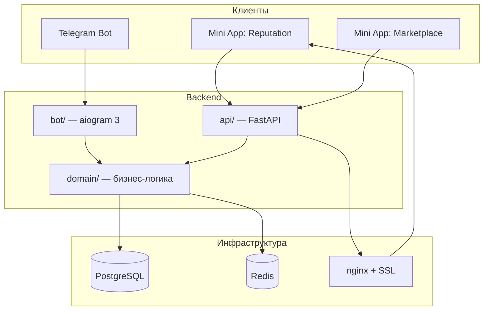

# JenBot

Мульти-компонентная платформа для Telegram-сообщества: репутационная база (anti-scam), модерация чатов, маркетплейс и система сделок с гарантом. Проект разрабатывается и поддерживается одним разработчиком; **развёрнут в production** (бот, API, PostgreSQL, Redis, nginx, Telegram Mini Apps).

> **Для рекрутера:** это не учебный pet-project на 300 строк. Это layered architecture с общим domain-слоем для бота и REST API, 22 миграции БД, Redis-кэш, фоновые задачи и два React-приложения. Ниже — карта репозитория и статус каждого модуля.

## Содержание

- [Архитектура](#архитектура)
- [Стек технологий](#стек-технологий)
- [Статус модулей](#статус-модулей)
- [Структура репозитория](#структура-репозитория)
- [Быстрый старт](#быстрый-старт)
- [Доменная модель (кратко)](#доменная-модель-кратко)
- [Что демонстрирует проект](#что-демонстрирует-проект)

## Архитектура



**Ключевой принцип:** `domain/` не зависит от aiogram и FastAPI. И бот, и API используют одни и те же сервисы, репозитории и исключения — изменения бизнес-логики не дублируются.

## Стек технологий

| Слой | Технологии |
|------|------------|
| Bot | Python 3.12, aiogram 3, Redis FSM |
| API | FastAPI, dependency-injector, Pydantic v2, Sentry |
| Domain | SQLAlchemy 2 (async), Alembic, asyncpg |
| Cache | Redis (auth, users, moderation, media) |
| Frontend | React 19, TypeScript, Vite, Zustand, TanStack Query |
| Mini Apps | Telegram Web App SDK, initData-авторизация |
| DevOps | Docker Compose, nginx, Let's Encrypt |

## Статус модулей

| Модуль | Статус | Описание |
|--------|--------|----------|
| Репутационная база | **Production** | Карточки пользователей, роли (гарант, скамер, депозитор…), детали, связанные аккаунты |
| Модерация чатов | **Production** | warn/mute/ban, chat violations, автоактуализация по расписанию |
| Mini App модерации | **Production** | Заполнение карточек без inline-кнопок в боте |
| Жалобы и отчёты | **Production** | Reports, scam reports, модераторский workflow |
| Подписки на каналы | **Production** | Middleware проверки подписки (настраивается через config) |
| REST API | **Production** | User, Reputation, Product, Marketplace, Messaging, Trading |
| Маркетплейс (API + domain) | **Частично** | Модели, репозитории, endpoints готовы; UI каталога — MVP |
| Mini App маркетплейса | **В разработке** | Каталог, поиск, фильтры — без полного checkout-flow |
| Внешние сделки (external deals) | **В разработке** | Domain + handlers написаны; роутер бота не подключён к dispatcher |
| Активности в чатах | **Запланировано** | — |

## Структура репозитория

```
JenBot/
├── bot/           # Telegram-бот (handlers, middlewares, FSM, scheduler)
├── api/           # REST API для Mini Apps и внешних клиентов
├── domain/        # Общая бизнес-логика (entities, services, repositories)
├── web/
│   ├── base/      # Mini App: модерация репутационных карточек
│   └── marketplace/  # Mini App: каталог объявлений
├── alembic/       # Миграции PostgreSQL (22 revision)
├── docker-compose.yml
├── Dockerfile
└── .env.example
```

Подробнее — в README каждого подпроекта:
- [bot/README.md](bot/README.md)
- [api/README.md](api/README.md)
- [domain/README.md](domain/README.md)
- [web/base/README.md](web/base/README.md)
- [web/marketplace/README.md](web/marketplace/README.md)
- [alembic/README.md](alembic/README.md)

## Быстрый старт

### Требования

- Python 3.12+
- Node.js 20+ (для frontend)
- Docker и Docker Compose (рекомендуется)

### 1. Переменные окружения

```bash
cp .env.example .env
# Заполните BOT_TOKEN, DATABASE_URL, REDIS_*, SENTRY_DSN и пути к media
```

### 2. Инфраструктура

```bash
docker compose up -d postgres redis
```

### 3. Миграции

```bash
pip install -r requirements.txt
alembic upgrade head
```

### 4. Запуск backend

```bash
# Бот
python -m bot.main
# API (отдельный терминал)
python -m api.main
```

### 5. Frontend (локально)

```bash
cd web/base && npm install && npm run dev
cd web/marketplace && npm install && npm run dev
```

### Production (Docker Compose)

```bash
docker compose up -d
```

Поднимаются: `postgres`, `redis`, `bot`, `api`, `nginx`, `certbot`. Статика Mini App (`web/base/dist`) монтируется в nginx.

## Доменная модель (кратко)

Основные bounded contexts:

- **User & Reputation** — пользователи Telegram, карточки репутации, роли, usernames, детали
- **Moderation** — violations, chat violations, reports, trackers, telegram files
- **Trading** — deals (money/trade), external deals с гарантом, scam reports, reviews
- **Marketplace** — products, categories, advertisements, options, trades
- **Messaging** — chats, messages, files
- **Economy** — transactions, purchases (задел под монетизацию)

26 доменных исключений маппятся в HTTP-ответы API и user-friendly сообщения в боте.

## Что демонстрирует проект

При оценке кандидата этот репозиторий показывает навыки, которые редко видны в «1 год по ГПХ»:

- **Layered / Clean Architecture** — разделение handlers/endpoints и domain
- **Unit of Work** — транзакции в боте через middleware
- **Repository + Service** — тестируемая бизнес-логика
- **Database design** — check constraints, partial unique indexes, enum-типы PostgreSQL
- **Async Python** — SQLAlchemy 2 async, aiogram 3, Redis
- **API design** — OpenAPI metadata, role-based auth, Telegram initData validation
- **Frontend** — React + TypeScript, draft-state для сложных форм, AccessGate
- **Production ops** — Docker, healthchecks, resource limits, Sentry, SSL

---

*Автор: full-stack разработка, проектирование domain layer, деплой и поддержка production.*